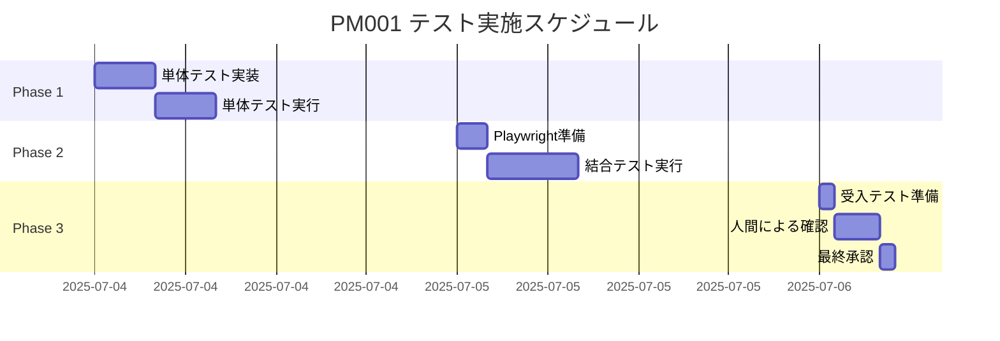

# PM001 郵便物発送管理システム テスト計画書 V3【改善版】

## 📋 テスト概要

### 1. テストの目的

本テスト計画は、Google Apps Script（GAS）で構築された「郵便物発送管理システム」が、定義された機能要件（料金体系、宛名選択、発送管理、顧客DB）をすべて満たし、小規模運用（最大80名、同時5名）において安定的かつ正確に動作することを包括的に検証します。

### 2. テスト範囲

#### ✅ 対象機能
- **料金計算ロジック**: `calculateShippingFeeNew` 関数の全分岐を網羅するテスト
- **宛名選択機能**: 4つの異なる選択パターン（顧客DB、ユーザー履歴、全体履歴、新規登録）の動作確認
- **発送記録・管理**: 追跡番号を含む発送記録の保存、および履歴の正確な更新
- **顧客データベース**: 会社名を含む顧客情報の登録と、部分一致検索の検証
- **データ連携**: GASとGoogle Spreadsheet間のデータ読み書きの整合性確認
- **セキュリティ**: アクセス制御とレート制限の動作確認
- **エラー処理**: 継続性を保つグレースフルな処理

#### ❌ 対象外
- 大規模負荷テスト（80名規模に特化）
- UIデザインの美観（機能優先）

### 3. テスト体制とスケジュール

| 役割 | 担当 | 責任範囲 |
|------|------|----------|
| テスト設計・承認 | 立法権（Claude Chat） | テスト計画承認、品質基準策定 |
| テスト実行 | 行政権（ChatGPT/Claude Code） | 自動テスト実行、手動テスト実施 |
| 品質審査 | 司法権（Gemini） | テスト結果審査、品質判定 |

#### スケジュール
- **Phase 1**: 単体テスト（1日）
- **Phase 2**: 結合テスト（1日）
- **Phase 3**: 受入テスト（半日）
- **合計**: 2.5日

### 4. テスト環境

```javascript
// テスト環境設定
const TEST_CONFIG = {
  environment: 'Google Apps Script',
  database: 'Google Spreadsheet (Test用)',
  browser: 'Google Chrome (最新版)',
  testDataSheet: 'PM001-Test-Data',
  maxConcurrentTests: 5,
  testTimeout: 60000 // 1分
};
```

---

## 🧪 テストケース詳細

### 5.1. サーバーサイド単体テスト（自動実行）

#### 料金計算テスト
```javascript
// テスト実行コード例
function testCalculateShippingFee() {
  const testCases = [
    // 普通郵便（規格内）
    { input: { weight: 50, shippingMethod: 'standard_regular' }, expected: 140 },
    { input: { weight: 100, shippingMethod: 'standard_regular' }, expected: 180 },
    { input: { weight: 150, shippingMethod: 'standard_regular' }, expected: 270 },
    { input: { weight: 250, shippingMethod: 'standard_regular' }, expected: 320 },
    
    // 普通郵便（規格内）+ 速達
    { input: { weight: 50, shippingMethod: 'standard_regular', isExpress: true }, expected: 390 },
    { input: { weight: 250, shippingMethod: 'standard_regular', isExpress: true }, expected: 570 },
    
    // 普通郵便（規格外）
    { input: { weight: 50, shippingMethod: 'standard_irregular' }, expected: 260 },
    { input: { weight: 100, shippingMethod: 'standard_irregular' }, expected: 290 },
    { input: { weight: 150, shippingMethod: 'standard_irregular' }, expected: 390 },
    { input: { weight: 250, shippingMethod: 'standard_irregular' }, expected: 450 },
    
    // レターパックライト
    { input: { shippingMethod: 'letterpack' }, expected: 430 },
    { input: { shippingMethod: 'letterpack', isExpress: true }, expected: 430 } // 速達不可
  ];
  
  let passCount = 0;
  const results = [];
  
  testCases.forEach((testCase, index) => {
    const result = calculateShippingFeeNew(testCase.input);
    const passed = result === testCase.expected;
    
    if (passed) passCount++;
    
    results.push({
      testId: `UT-FEE-${String(index + 1).padStart(3, '0')}`,
      input: testCase.input,
      expected: testCase.expected,
      actual: result,
      passed: passed
    });
  });
  
  console.log(`料金計算テスト: ${passCount}/${testCases.length} 合格`);
  return results;
}
```

#### データ操作テスト
```javascript
// 顧客登録・検索テスト
function testCustomerOperations() {
  const testResults = [];
  
  // テストデータ準備
  const testCustomer = {
    name: 'テスト太郎_' + new Date().getTime(),
    email: 'test@example.com',
    companyName: 'テスト株式会社',
    tel: '03-1234-5678'
  };
  
  // 1. 顧客登録テスト
  try {
    const customerId = saveCustomer(testCustomer);
    testResults.push({
      testId: 'UT-CUST-001',
      description: '顧客登録（会社名あり）',
      passed: customerId !== null
    });
  } catch (error) {
    testResults.push({
      testId: 'UT-CUST-001',
      description: '顧客登録（会社名あり）',
      passed: false,
      error: error.toString()
    });
  }
  
  // 2. 検索テスト
  try {
    const searchResults = searchCustomers('テスト株式会社');
    const found = searchResults.some(c => c.companyName === testCustomer.companyName);
    testResults.push({
      testId: 'UT-CUST-002',
      description: '会社名検索',
      passed: found
    });
  } catch (error) {
    testResults.push({
      testId: 'UT-CUST-002',
      description: '会社名検索',
      passed: false,
      error: error.toString()
    });
  }
  
  return testResults;
}
```

### 5.2. 結合テスト（Playwright/手動実行）

#### Playwright自動テストスクリプト
```javascript
// Playwright統合テスト
const { test, expect } = require('@playwright/test');

test.describe('PM001 郵便物発送管理システム', () => {
  const baseUrl = 'https://script.google.com/macros/s/[YOUR_WEBAPP_ID]/exec';
  
  test.beforeEach(async ({ page }) => {
    await page.goto(baseUrl);
    await expect(page).toHaveTitle(/PM001 郵便物発送管理システム/);
  });
  
  test('IT-001: 新規顧客・新規宛名での発送', async ({ page }) => {
    // 宛名選択
    await page.selectOption('#addressSelect', 'new');
    
    // 顧客情報入力
    await page.fill('#customerName', 'Playwright太郎');
    await page.fill('#companyName', 'Playwright株式会社');
    await page.fill('#email', 'playwright@example.com');
    
    // 宛名情報入力
    await page.fill('#recipientName', 'Playwright受取人');
    await page.fill('#postalCode', '100-0001');
    await page.fill('#address', '東京都千代田区千代田1-1');
    
    // 発送方法選択
    await page.selectOption('#shippingMethod', 'standard_regular');
    await page.fill('#weight', '80');
    
    // 料金確認
    await expect(page.locator('#calculatedFee')).toHaveText('180');
    
    // 発送記録保存
    await page.click('#submitButton');
    
    // 成功メッセージ確認
    await expect(page.locator('.alert-success')).toBeVisible();
  });
  
  test('IT-002: レターパック発送（追跡番号あり）', async ({ page }) => {
    // 既存顧客選択
    await page.selectOption('#addressSelect', 'database');
    await page.fill('#customerSearch', 'Playwright');
    await page.click('.search-result:first-child');
    
    // レターパック選択
    await page.selectOption('#shippingMethod', 'letterpack');
    
    // 追跡番号入力欄の表示確認
    await expect(page.locator('#trackingField')).toBeVisible();
    await page.fill('#trackingNumber', '1234-5678-9012');
    
    // 料金確認
    await expect(page.locator('#calculatedFee')).toHaveText('430');
    
    // 発送記録保存
    await page.click('#submitButton');
    
    // 成功確認
    await expect(page.locator('.alert-success')).toBeVisible();
  });
  
  test('IT-003: 同時5接続シミュレーション', async ({ browser }) => {
    const contexts = [];
    const pages = [];
    
    // 5つの同時接続を作成
    for (let i = 0; i < 5; i++) {
      const context = await browser.newContext();
      const page = await context.newPage();
      await page.goto(baseUrl);
      contexts.push(context);
      pages.push(page);
    }
    
    // 全ページで同時に操作
    const promises = pages.map(async (page, index) => {
      await page.selectOption('#shippingMethod', 'standard_regular');
      await page.fill('#weight', String(50 + index * 10));
      return await page.locator('#calculatedFee').textContent();
    });
    
    const results = await Promise.all(promises);
    
    // 全ての計算が正常に完了することを確認
    expect(results).toHaveLength(5);
    expect(results[0]).toBe('140'); // 50g
    expect(results[1]).toBe('140'); // 60g
    expect(results[2]).toBe('140'); // 70g
    expect(results[3]).toBe('140'); // 80g
    expect(results[4]).toBe('140'); // 90g
    
    // クリーンアップ
    for (const context of contexts) {
      await context.close();
    }
  });
});
```

### 5.3. セキュリティ・エラー処理テスト

#### セキュリティテスト
```javascript
function testSecurity() {
  const testResults = [];
  
  // 1. レート制限テスト
  try {
    const userEmail = 'ratelimit@test.com';
    
    // 60回連続アクセス
    for (let i = 0; i < 61; i++) {
      SecurityConfig.checkRateLimit(userEmail);
    }
    
    // 61回目でエラーになるはず
    testResults.push({
      testId: 'SEC-001',
      description: 'レート制限',
      passed: false,
      note: 'エラーが発生しませんでした'
    });
  } catch (error) {
    testResults.push({
      testId: 'SEC-001',
      description: 'レート制限',
      passed: error.message.includes('アクセス過多'),
      error: error.message
    });
  }
  
  // 2. 認証チェック
  const authorizedEmail = 'user@company.com';
  const unauthorizedEmail = 'hacker@evil.com';
  
  testResults.push({
    testId: 'SEC-002',
    description: '認証済みドメイン',
    passed: SecurityConfig.isAuthorizedUser(authorizedEmail) === true
  });
  
  testResults.push({
    testId: 'SEC-003',
    description: '未認証ドメイン',
    passed: SecurityConfig.isAuthorizedUser(unauthorizedEmail) === false
  });
  
  return testResults;
}
```

### 5.4. 5分クイックテスト（日次実行用）

```javascript
function quickHealthCheck() {
  console.log('🚀 5分クイックテスト開始');
  const startTime = new Date();
  
  const results = {
    timestamp: startTime,
    tests: []
  };
  
  // 1. 基本料金計算（30秒）
  const feeTest = calculateShippingFeeNew({ weight: 100, shippingMethod: 'standard_regular' });
  results.tests.push({
    name: '料金計算',
    passed: feeTest === 180,
    duration: new Date() - startTime
  });
  
  // 2. データベース接続（30秒）
  try {
    const sheet = SpreadsheetApp.openById(CONFIG.SPREADSHEET_ID);
    results.tests.push({
      name: 'DB接続',
      passed: sheet !== null,
      duration: new Date() - startTime
    });
  } catch (error) {
    results.tests.push({
      name: 'DB接続',
      passed: false,
      error: error.toString(),
      duration: new Date() - startTime
    });
  }
  
  // 3. WebApp応答（1分）
  // ※実際のURLでfetch実行
  
  // 4. 同時接続数確認（30秒）
  const connections = MonitoringSimple.getCurrentConnections();
  results.tests.push({
    name: '同時接続数',
    passed: connections.length <= 5,
    current: connections.length,
    duration: new Date() - startTime
  });
  
  const totalDuration = new Date() - startTime;
  console.log(`✅ クイックテスト完了: ${totalDuration}ms`);
  
  return results;
}
```

---

## 📊 テストデータ準備

### テストデータ生成スクリプト
```javascript
function prepareTestData() {
  const testData = {
    customers: [
      { name: 'テスト顧客A', email: 'test-a@example.com', companyName: 'テスト株式会社A', tel: '03-1111-1111' },
      { name: 'テスト顧客B', email: 'test-b@example.com', companyName: '', tel: '03-2222-2222' },
      { name: 'テスト顧客C', email: 'test-c@example.com', companyName: 'テスト有限会社C', tel: '03-3333-3333' }
    ],
    addresses: [
      { customerId: 'CUST_A', recipientName: 'テスト受取人A1', postalCode: '100-0001', address: '東京都千代田区1-1' },
      { customerId: 'CUST_A', recipientName: 'テスト受取人A2', postalCode: '100-0002', address: '東京都千代田区2-2' },
      { customerId: 'CUST_B', recipientName: 'テスト受取人B1', postalCode: '100-0003', address: '東京都千代田区3-3' }
    ],
    shippingHistory: []
  };
  
  // テストシートへの書き込み
  const sheet = SpreadsheetApp.create('PM001-Test-Data-' + new Date().getTime());
  
  // 各シート作成
  ['Customers', 'Addresses', 'Shipping', 'UserHistory', 'AddressUsage', 'SystemLog'].forEach(sheetName => {
    if (sheet.getSheetByName(sheetName) === null) {
      sheet.insertSheet(sheetName);
    }
  });
  
  return sheet.getId();
}
```

---

## ✅ 合格基準

### 機能テスト合格基準
- **単体テスト**: 全テストケースの95%以上が合格
- **結合テスト**: 全シナリオが正常に完了
- **料金計算精度**: 100%（1円の誤差も許容しない）
- **データ整合性**: 100%（保存データの欠損・不整合なし）

### 性能基準（小規模運用）
- **画面表示**: 2秒以内
- **発送記録保存**: 3秒以内
- **検索結果表示**: 2秒以内
- **同時5接続**: エラーなし

### セキュリティ基準
- **レート制限**: 正常動作
- **アクセス制御**: 未認証ドメイン拒否
- **エラー処理**: システム情報の漏洩なし

---

## 🚨 リスク管理

### 識別されたリスク
| リスク | 影響度 | 発生可能性 | 対策 |
|--------|--------|------------|------|
| GAS実行時間超過 | 高 | 低 | バッチ処理の分割実行 |
| Spreadsheet容量超過 | 中 | 低 | 定期的なアーカイブ |
| 同時接続数超過 | 低 | 中 | エラーメッセージで案内 |
| ネットワーク障害 | 高 | 低 | リトライ機能実装 |

### エスカレーション基準
- **重大バグ**: 料金計算の誤り → 即座に立法権へ報告
- **データ損失**: 発送記録の消失 → 緊急対応・全権力協働
- **セキュリティ**: 不正アクセス検知 → 司法権による調査

---

## 📅 テスト実施スケジュール



---

## 🎯 テスト完了条件

1. **全テストケース実行完了**
2. **合格基準達成（95%以上）**
3. **重大バグゼロ**
4. **セキュリティ脆弱性ゼロ**
5. **5分クイックテスト合格**
6. **三権分立による承認**
   - 立法権：テスト計画承認
   - 行政権：テスト実行完了
   - 司法権：品質基準達成確認

---

**このテスト計画書V3により、PM001の品質を確実に保証し、80名規模での安定運用を実現します。**